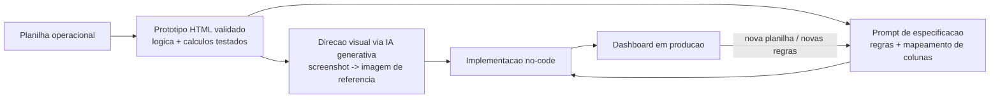

# Painel de Programações — Dashboard de Diretoria

Dashboard executivo **read-only** para operações de exportação, construído na plataforma
no-code **base44** e alimentado por **upload manual** de uma planilha operacional
(`.xlsx`, aba `PROGRAMAÇÃO`). O painel consolida status de retirada de contêineres,
confirmação de booking, risco de detention e distribuição geográfica/por planta para
visão de gestão.

> **Natureza do repositório:** o dashboard em si roda no base44 (no-code) e não é
> versionável como código. Este repositório documenta a **lógica de negócio, o
> mapeamento de dados, o protótipo HTML de validação e o histórico de prompts**
> entregues à plataforma — que são os artefatos-fonte reais do projeto.

---

## Visão geral

- **Domínio:** logística de exportação (rastreamento de contêineres, booking, saída de
  planta, chegada ao porto).
- **Empresas envolvidas:** duas parceiras operacionais, um operador logístico e um
  cliente exportador (nomes generalizados por confidencialidade).
- **Plataforma:** base44 (free tier — conservação de créditos é uma restrição de
  projeto).
- **Fonte de dados:** planilha Excel mantida manualmente ([módulo
  `planilha-colaborativa/`](../planilha-colaborativa/)); upload substitui a base a cada
  carga (sem histórico acumulado).
- **Modo:** somente leitura — o site nunca grava de volta na planilha.

---

## Arquitetura de dados

O fluxo é deliberadamente simples e desacoplado da planilha de origem:

```
Planilha Excel (aba PROGRAMAÇÃO)
        │  export .xlsx
        ▼
Upload manual no base44  ──►  Parser (leitura por nome de cabeçalho normalizado)
        │                              │
        │                              ▼
        │                     Row objects (campos extraídos)
        ▼                              │
Substituição total da base            ▼
                              KPIs + gráficos + tabela de detalhe (read-only)
```

### Princípio central: leitura por nome de cabeçalho

As colunas são lidas pelo **nome normalizado do cabeçalho**, não por índice fixo. Isso é
o que mantém o painel resiliente a reorganizações futuras da planilha. Índices são
apenas *fallback*.

> **Padrão recorrente a vigiar:** colunas novas frequentemente entram na camada de
> exibição da tabela mas não são conectadas ao parser — sempre exige instrução explícita
> para extrair o campo novo para o objeto de linha.

---

## Mapeamento de colunas confirmado

Uma amostra fictícia ilustrando esse mapeamento está em
[`docs/amostra-dados.md`](./docs/amostra-dados.md).

| Campo | Cabeçalho | Índice fallback |
|---|---|---|
| STATUS | STATUS | 0 |
| DESTINO | DESTINO | 2 |
| PAÍS DE DESTINO | PAIS DE DESTINO | 3 |
| REF CLIENTE | REF CLIENTE | 7 |
| SEMANA PROGRAMADA | SEMANA PROGRAMADA | 10 |
| DATA DE ESTUFAGEM | DATA DE ESTUFAGEM | 11 |
| UNIDADE DETALHADA | UNIDADE DETALHADA | 13 |
| REF INTERNA (OPERADOR) | REF INTERNA | 15 |
| TIPO DE SOLICITAÇÃO | TIPO DE SOLICITACAO | 17 |
| TIPO DE RETIRADA | TIPO DE RETIRADA | 20 |
| BOOKING | BOOKING | 21 |
| NAVIO | NAVIO | 22 |
| ARMADOR | ARMADOR | 23 |
| DEADLINE DE CARGA | DEADLINE DE CARGA | 25 |
| DATA LIMITE DEPÓSITO | DATA LIMITE DEPOSITO | 29 |
| CONTAINER | CONTAINER | 33 |
| DATA/HORA SAÍDA PLANTA | DATA/HORA SAÍDA PLANTA | 44 |
| LOCAL DE DEPÓSITO | LOCAL DE DEPÓSITO | 55 |
| DATA ABERTURA GATE | DATA ABERTURA GATE | 56 |
| DATA DE DEPÓSITO | DATA DE DEPÓSITO | 58 |
| ETA CHEGADA PORTO | ETA CHEGADA PORTO | 62 |

*(índices sujeitos a deslocamento — daí a leitura por nome)*

---

## Indicadores implementados

### KPIs (topo)
1. **Contratos** — contagem de `REF CLIENTE` distintas.
2. **Contêineres ativos** — total de linhas ativas (exclui Cancelados), com quebra
   Programação × Extra.
3. **Retirados** — contagem por status.
4. **Pendentes** — nova programação, aguardando retirada.
5. **Aguardando booking** — booking não confirmado.
6. **Risco de detention** — margem ≤ 2 dias até a data-limite de depósito.

### Cards / gráficos
- **Retirados × Pendentes** (donut)
- **Programação × Extra** (donut — tipo de solicitação)
- **Status de booking** (donut — 3 estados: Confirmado / Aguardando / Sem booking)
- **Contêineres por país de destino** (barras horizontais)
- **Contêineres por planta** (barras horizontais)
- **Faixas de risco de detention** — Estourado (<0) / Crítico (0–2) / Atenção (3–5) / Ok
  (>5)
- **Saída de planta** (donut) e **previsão de chegada ao porto (ETA)** — calculada na
  planilha por regra de threshold de 20h entre quatro plantas.

### Interatividade
- Filtro por semana (single ou multi-seleção com Ctrl/⌘).
- Cards clicáveis abrem tabela de detalhe local (filtro, checkbox, copiar, download).
- Tema escuro como padrão, com toggle.

---

## Regras de negócio confirmadas

- **Normalização de país:** `MÉXICO` e `MEXICO` são o mesmo país — unificados **na
  leitura**, não só na exibição.
- **Cancelado** não entra em nenhuma contagem de ativos (com nuances específicas para
  *Contratos* — tratar com cuidado).
- **Booking — 3 estados:** número válido = Confirmado; texto `AG BOOKING` = Aguardando;
  vazio = Sem booking.
- **Risco de detention:** baseado na margem de dias; unidades já depositadas (com `DATA
  DE DEPÓSITO`) são excluídas do risco.
- **Override de retirada operacional:** se `TIPO DE RETIRADA` indica um fluxo interno
  específico do operador logístico e o contêiner é válido, a linha é tratada como
  *Retirado* independentemente do status na coluna principal.
- **Validade de contêiner:** exatamente 11 caracteres após trim de espaços/tabs.
- **Chave única de linha** (para comparar bookings entre uploads): composto de `REF
  CLIENTE` + `REF INTERNA` — validado como 100% único no dataset.

---

## Decisões de engenharia (learnings)

- **Validar antes de construir** — cada KPI foi confirmado programaticamente contra
  dados reais antes de qualquer implementação visual.
- **Lógica de negócio nunca vem de asset de design** — visuais gerados no
  Gemini/Nanobanana foram usados estritamente como referência de estilo, nunca como
  fonte de regra.
- **Defensividade do parser** — cabeçalhos vazios/sem nome causam crash em runtime
  (`Cannot read properties of undefined`); higiene da planilha é pré-requisito.
- **Autenticação removida** — exigiu direitos públicos explícitos de Create/Update na
  entidade `Programacao` para resolver cascata de erros de permissão RLS.

## Processo de desenvolvimento (3 camadas)

1. **Especificação funcional executável** — protótipo HTML/JS interativo com os dados
   reais da planilha, validando cálculo por cálculo antes de qualquer design visual. Esse
   protótipo virou a fonte da verdade: cada indicador, cada regra de classificação e cada
   interação de clique foi testado programaticamente contra a base real antes de ser
   considerado "aprovado".
2. **Direção visual desacoplada da lógica** — design explorado separadamente, usando
   geração de imagem por IA (Gemini/Nanobanana) a partir de screenshots do protótipo
   funcional. Uma imagem de design comunica estilo, não regras de negócio.
3. **Implementação em plataforma no-code** — o protótipo validado, o mapeamento de
   colunas e a direção visual traduzidos em prompts precisos e completos para a
   plataforma no-code, iterando em rodadas de ajuste conforme o produto evoluía em
   produção.



## Desafios de plataforma

Nem todo obstáculo foi de lógica de negócio — parte do trabalho foi diagnosticar
comportamento de uma plataforma no-code em produção:

- Um requisito de "acesso restrito ao administrador" quebrou de forma sutil: a página de
  administração corretamente exigia login, mas o sistema de autenticação da plataforma
  não estava configurado, gerando um redirecionamento para uma tela inexistente. O
  diagnóstico exigiu isolar se o problema era de rota, de permissão ou de autenticação —
  descobertos em sequência através de testes dirigidos, não por tentativa e erro.
- Ao simplificar o modelo de acesso (removendo a exigência de login para reduzir
  fricção), o upload de dados passou a falhar com um erro de permissão — porque a regra
  de escrita da entidade ainda exigia um papel de usuário que deixara de existir. A causa
  raiz estava na configuração de segurança da plataforma (regras de row-level security
  por entidade), não no código da aplicação.

## Resultado

O dashboard resultante entrega, a partir de um simples upload de planilha:

- Indicadores executivos (contratos ativos, containers retirados/pendentes, bookings
  aguardando confirmação, unidades em risco de multa por atraso de depósito)
- Visões cruzadas por país de destino, planta de origem e status de booking
- Detalhamento interativo por clique, com colunas de contexto específicas para cada tipo
  de consulta
- Um indicador de "o que mudou desde o último upload", construído por comparação de
  estado entre versões da base
- Busca livre por qualquer referência de rastreamento, retornando todos os registros
  relacionados

Todas as regras de negócio foram validadas contra a base real *antes* de qualquer prompt
ser enviado à plataforma de implementação — cada indicador tinha um número esperado
documentado, o que tornou o QA pós-implementação uma checagem objetiva (bateu ou não
bateu) em vez de uma inspeção visual subjetiva.

## O que esse projeto exercitou

- **Levantamento de requisitos com ceticismo produtivo** — tratar toda regra de negócio
  verbalizada pelo cliente como hipótese a validar contra os dados reais, não como fato a
  implementar direto.
- **Engenharia de prompt para produtos, não para respostas** — especificações completas
  o suficiente para funcionar corretamente na primeira tentativa, importante em
  contextos de créditos/custos limitados de geração.
- **Separação de responsabilidades entre ferramentas de IA** — usar geração de imagem
  para estilo, protótipo funcional para lógica, e reconhecer explicitamente onde a
  fronteira entre os dois não pode ser cruzada.
- **Debugging em camadas** — distinguir bug de lógica, bug de configuração de plataforma
  e bug de permissão, cada um exigindo uma abordagem de diagnóstico diferente.
- **Comunicação técnica assíncrona** — cada rodada de mudança documentada com o número
  exato de registros afetados, permitindo ao cliente validar objetivamente sem depender
  de "parece certo".

## Stack / ferramentas

| Ferramenta | Papel |
|---|---|
| **base44** | Plataforma no-code que hospeda o dashboard (free tier) |
| **Excel** | Planilha-fonte (`aba PROGRAMAÇÃO`), mantida e enviada manualmente |
| **Gemini / Nanobanana** | Direção visual/design e geração de logo (referência de estilo apenas) |
| **HTML/JS** | Protótipo funcional validado contra dados reais antes do trabalho visual |

## Roadmap / em aberto

- **Dashboard client-facing** (sem botão de upload) — adiado para round futuro.
- **Chatbot** — rejeitado por custo de créditos de integração no plano free.
- Créditos free-tier quase esgotados — rounds futuros exigem planejamento cuidadoso.

## Especificação e protótipo

- [`docs/spec-dashboard-diretoria-v1.md`](./docs/spec-dashboard-diretoria-v1.md) — especificação funcional que serviu de base para o prompt enviado à plataforma no-code.
- [`prototype/PAINEL_Mockup_Dados_Ficticios.html`](./prototype/PAINEL_Mockup_Dados_Ficticios.html) — protótipo HTML/JS usado para validar cálculo por cálculo antes de qualquer implementação visual, com um dataset **fictício** no lugar dos dados reais originais.
- [`prototype/PAINEL_Dashboard_Diretoria.html`](./prototype/PAINEL_Dashboard_Diretoria.html) — versão de referência do painel com o mesmo dataset fictício.

## Estrutura deste módulo

```
dashboard-diretoria/
├── README.md                        # este arquivo
└── docs/
    └── amostra-dados.md             # amostra fictícia da estrutura de dados
```

---

*Nomes de empresas e valores absolutos de operação foram omitidos/generalizados neste
case por confidencialidade. A arquitetura, as decisões técnicas e o processo descritos
refletem fielmente o projeto real.*
