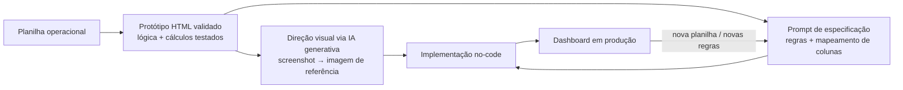

# Dashboard de Programação de Exportação — um case de desenvolvimento orientado por IA sem código

**Tipo de projeto:** dashboard executivo de logística, construído em uma plataforma no-code (base44), a partir de uma planilha operacional já existente
**Meu papel:** condução do projeto de ponta a ponta — levantamento de requisitos, validação de dados, arquitetura de decisões de negócio, engenharia de prompt e QA
**Ferramentas:** planilha operacional (Excel), assistente de IA para análise de dados e prompt engineering, plataforma no-code base44, geração de imagem por IA (Google Gemini) para direção visual

---

## O problema

Duas empresas parceiras — uma operadora logística e um cliente exportador — controlavam toda a programação de containers (semanas, bookings, destinos, prazos de detention) numa planilha operacional densa, com dezenas de colunas técnicas. Funcionava bem para quem operava a planilha no dia a dia, mas era inacessível para a diretoria: ninguém ia abrir uma planilha de 250+ linhas e 50+ colunas para saber "quantos containers estão em risco de multa esta semana".

O objetivo era um **dashboard de leitura**, alimentado pela mesma planilha, que traduzisse os dados operacionais em indicadores de gestão — sem duplicar o trabalho de manutenção da planilha e sem exigir que a diretoria aprendesse a navegar nela.

## Abordagem

O projeto foi conduzido em três camadas que se retroalimentavam:

1. **Especificação funcional executável** — antes de qualquer design visual, construí um prototipo HTML/JS interativo com os dados reais da planilha, validando cálculo por cálculo com um assistente de IA. Esse protótipo virou a fonte da verdade: cada indicador, cada regra de classificação e cada interação de clique foi testado programaticamente contra a base real antes de ser considerado "aprovado".
2. **Direção visual desacoplada da lógica** — o design foi explorado separadamente, usando geração de imagem por IA (Nanobanana/Gemini) a partir de screenshots do protótipo funcional. Essa separação foi deliberada: uma imagem de design comunica estilo, não regras de negócio, e tratá-la como especificação teria introduzido erros silenciosos.
3. **Implementação em plataforma no-code** — o protótipo validado, o mapeamento de colunas e a direção visual foram então traduzidos em prompts precisos e completos para a plataforma no-code, iterando em rodadas de ajuste conforme o produto evoluía em produção.

## Decisões técnicas que valem destacar

**Leitura de colunas por nome, não por posição.**
A planilha de origem seria reorganizada ao longo do tempo (colunas inseridas, removidas, reposicionadas). Ler por índice fixo é uma armadilha clássica: o sistema não erra "com barulho" — ele silenciosamente lê a coluna errada e produz números plausíveis, porém incorretos. A solução foi normalizar e casar cabeçalhos por nome (removendo quebras de linha, emojis e acentos, e comparando por igualdade exata) com um índice de fallback. Esse investimento se provou na prática: numa atualização posterior da planilha, doze colunas mudaram de posição simultaneamente, e o dashboard continuou funcionando sem qualquer ajuste de código.

**Chave composta para comparação entre uploads.**
Uma feature pedia "quantos bookings foram confirmados desde a última atualização" — o que exige comparar duas cargas de dados e casar a mesma unidade lógica entre elas. O campo óbvio ("referência do cliente") não era, sozinho, uma chave confiável: tinha duplicatas. Um segundo campo candidato também falhava sozinho (um mesmo valor cobria múltiplos containers de um mesmo embarque). A solução foi validar estatisticamente contra a base real até encontrar o par de campos que garantia unicidade total, e só então implementar a comparação.

**Regras de validação que sinalizam, mas não decidem sozinhas.**
Um pedido natural seria "se o container não é válido, reclassifique o status automaticamente". Isso foi deliberadamente evitado por padrão: a coluna de status manual continuou sendo a fonte de verdade, e a validação de formato virou apenas um alerta de qualidade de dado, não uma sobrescrita silenciosa. Quando, mais adiante, surgiu um caso de negócio genuíno para uma exceção (um tipo específico de operação, combinado com um dado já confiável, deveria sim sobrepor o status manual), a exceção foi adicionada de forma explícita e isolada — documentando que era uma exceção, não a regra geral.

**Higienização de string como requisito, não como detalhe.**
A regra "container válido tem 11 caracteres" parecia trivial até a validação contra os dados reais revelar um registro com um caractere de tabulação antes do código — sem o trim, esse registro (válido) teria sido descartado por engano. Validar contra dados reais antes de escrever qualquer regra evitou esse tipo de falso negativo silencioso.

## Desafios de plataforma

Nem todo obstáculo foi de lógica de negócio — parte do trabalho foi diagnosticar comportamento de uma plataforma no-code em produção:

- Um requisito de "acesso restrito ao administrador" quebrou de forma sutil: a página de administração corretamente exigia login, mas o sistema de autenticação da plataforma não estava configurado, gerando um redirecionamento para uma tela inexistente. O diagnóstico exigiu isolar se o problema era de rota, de permissão ou de autenticação — descobertos em sequência através de testes dirigidos, não por tentativa e erro.
- Ao simplificar o modelo de acesso (removendo a exigência de login para reduzir fricção), o upload de dados passou a falhar com um erro de permissão — porque a regra de escrita da entidade ainda exigia um papel de usuário que deixara de existir. A causa raiz estava na configuração de segurança da plataforma (regras de row-level security por entidade), não no código da aplicação.

## Resultado

O dashboard resultante entrega, a partir de um simples upload de planilha:

- Indicadores executivos (contratos ativos, containers retirados/pendentes, bookings aguardando confirmação, unidades em risco de multa por atraso de depósito)
- Visões cruzadas por país de destino, planta de origem e status de booking
- Detalhamento interativo por clique, com colunas de contexto específicas para cada tipo de consulta
- Um indicador de "o que mudou desde o último upload", construído por comparação de estado entre versões da base
- Busca livre por qualquer referência de rastreamento, retornando todos os registros relacionados

Todas as regras de negócio foram validadas contra a base real *antes* de qualquer prompt ser enviado à plataforma de implementação — cada indicador tinha um número esperado documentado, o que tornou o QA pós-implementação uma checagem objetiva (bateu ou não bateu) em vez de uma inspeção visual subjetiva.

## O que esse projeto exercitou

- **Levantamento de requisitos com ceticismo produtivo** — tratar toda regra de negócio verbalizada pelo cliente como hipótese a validar contra os dados reais, não como fato a implementar direto.
- **Engenharia de prompt para produtos, não para respostas** — especificações completas o suficiente para funcionar corretamente na primeira tentativa, importante em contextos de créditos/custos limitados de geração.
- **Separação de responsabilidades entre ferramentas de IA** — usar geração de imagem para estilo, protótipo funcional para lógica, e reconhecer explicitamente onde a fronteira entre os dois não pode ser cruzada.
- **Debugging em camadas** — distinguir bug de lógica, bug de configuração de plataforma e bug de permissão, cada um exigindo uma abordagem de diagnóstico diferente.
- **Comunicação técnica assíncrona** — cada rodada de mudança documentada com o número exato de registros afetados, permitindo ao cliente validar objetivamente sem depender de "parece certo".

---

*Nomes de empresas e valores absolutos de operação foram omitidos/generalizados neste case por confidencialidade. A arquitetura, as decisões técnicas e o processo descritos refletem fielmente o projeto real.*
